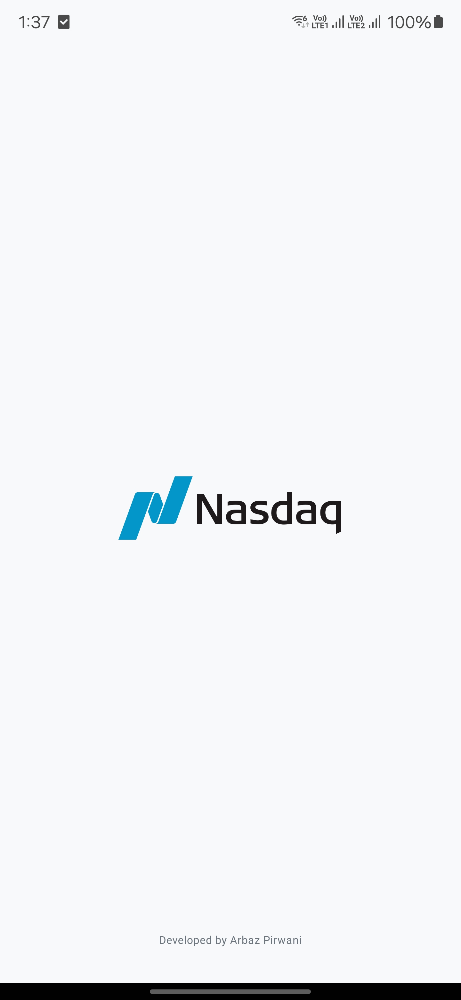
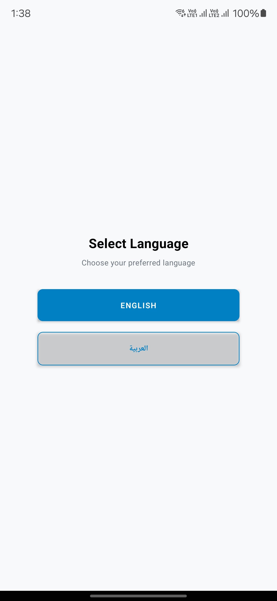
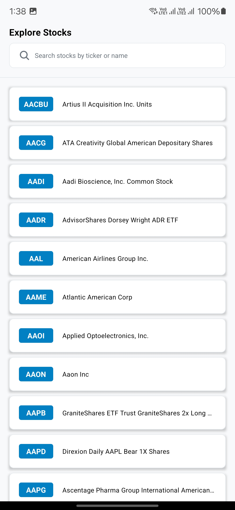

# Stockitect-CleanMVVM

<p align="center">
  
</p>

A modern React Native mobile application for browsing stocks listed on the Nasdaq exchange. Built with clean architecture principles (MVVM), TypeScript, and industry best practices.

## 🏗️ Architecture

This project follows the MVVM (Model-View-ViewModel) architecture pattern for clear separation of concerns:

```
src/
├── api/         # API clients and data fetching
├── components/  # UI components (atoms, molecules)
├── constants/   # App-wide constants and configuration
├── features/    # Feature-specific screens
├── i18n/        # Internationalization
├── navigation/  # Navigation configuration
├── repositories/# Data repositories (bridge between API and ViewModels)
├── theme/       # Styling system
├── types/       # TypeScript type definitions
├── utils/       # Helper utilities
└── viewmodels/  # Business logic and state management
```

## ✨ Features

- **Multi-language Support** - English and Arabic with RTL layout support
- **Stock Exploration** - Browse stocks listed on the Nasdaq exchange
- **Real-time Search** - Search stocks by ticker or company name
- **Error Handling** - Graceful error handling with retry options
- **Clean UI** - Modern, responsive interface following design best practices
- **Caching** - Smart caching system to reduce redundant API calls
- **Offline Support** - Basic functionality when offline via cache

## 📱 Screenshots & Demo

### Screenshots

<p align="center">
  
  
  
</p>

### Demo
<p align="center">  </p>

## 🛠️ Tech Stack

- **React Native** - Core framework
- **TypeScript** - Type safety and better developer experience
- **MVVM Architecture** - Clean separation of concerns
- **Jest & Testing Library** - Comprehensive unit testing
- **React Navigation** - Navigation between screens
- **i18next** - Internationalization
- **Axios** - API requests with interceptors for clean error handling
- **AsyncStorage** - Local data persistence

## 🚀 Getting Started

### Prerequisites

- Node.js 18+
- npm or yarn
- React Native CLI
- Android Studio / Xcode

### Installation

1. Clone the repository:
   ```bash
   git clone https://github.com/yourusername/Stockitect-CleanMVVM.git
   cd Stockitect-CleanMVVM
   ```

2. Install dependencies:
   ```bash
   npm install
   # or
   yarn install
   ```

3. Set up your Polygon.io API key:
    - Copy `.env.example` to `.env`
    - Add your API key to the `.env` file:
      ```
      POLYGON_API_KEY=your_api_key_here
      ```

### Running the App

#### iOS

```bash
npm run ios
# or
npx react-native run-ios
```

#### Android

```bash
npm run android
# or
npx react-native run-android
```

## 🧪 Testing

The project includes comprehensive unit tests to ensure reliability. Run the test suite with:

```bash
npm test
```

Test coverage report:
```
-------------------------------|---------|----------|---------|---------|-------------------------------
File                           | % Stmts | % Branch | % Funcs | % Lines | Uncovered Line #s
-------------------------------|---------|----------|---------|---------|-------------------------------
All files                      |   77.28 |    69.61 |   73.46 |   77.32 |
 src/api                       |   76.47 |       80 |      75 |      80 |
  apiClient.ts                 |   76.47 |       80 |      75 |      80 | 25-27
 src/api/polygon               |      70 |    57.14 |     100 |   69.23 | 22-49,81-84,166
 src/components/atoms          |   73.33 |    76.19 |     100 |   73.33 |
  Button.tsx                   |   73.33 |    76.19 |     100 |   73.33 | 79,83,95,99
 src/components/molecules      |   89.85 |    82.35 |   73.07 |   89.55 |
  ErrorView.tsx                |    100  |    100   |    100  |   100   |
  SearchBar.tsx                |   85.71 |    85.71 |      60 |   85.71 | 100-101
  SortFilterBar.tsx            |   73.68 |    77.08 |   58.33 |   73.68 | 60-70,105,145,224
  StockDetailsBottomSheet.tsx  |    100  |    93.75 |    100  |   100   | 159
  StockGridItem.tsx            |    100  |     75   |    100  |   100   | 48
  StockListItem.tsx            |    100  |    87.50 |    100  |   100   | 59
 src/constants                 |    100  |    100   |    100  |   100   |
  api.ts                       |    100  |    100   |    100  |   100   |
  config.ts                    |    100  |    100   |    100  |   100   |
  index.ts                     |    100  |    100   |    100  |   100   |
  storage.ts                   |    100  |    100   |    100  |   100   |
  ui.ts                        |    100  |    100   |    100  |   100   |
 src/features/language/screens |     90  |     50   |     80  |    90   | 33
 src/features/splash/screens   |    100  |    100   |    100  |   100   |
  SplashScreen.tsx             |    100  |    100   |    100  |   100   |
 src/features/stocks/screens   |   60.6  |   52.63  |     40  |   61.29 | 61,66,72-73,101-104,150-151,181-184
 src/i18n                      |   63.33 |    33.33 |     60  |   63.33 | 
  index.ts                     |   63.33 |    33.33 |     60  |   63.33 | 28-29,38-39,50,55,77-79,85-86
 src/i18n/translations         |     0   |     0    |     0   |    0    |
  ar.ts                        |     0   |     0    |     0   |    0    |
  en.ts                        |     0   |     0    |     0   |    0    |
 src/navigation                |    100  |      100 |    100  |   100   |
  AppNavigator.tsx             |    100  |      100 |    100  |   100   |
  types.ts                     |     0   |      0   |     0   |    0    |
 src/repositories              |   93.75 |     86.2 |    100  |   93.75 |
  StocksRepository.ts          |   93.75 |     86.2 |    100  |   93.75 | 106,120
  index.ts                     |     0   |      0   |     0   |    0    |
 src/theme                     |    100  |      100 |    100  |   100   |
  colors.ts                    |    100  |      100 |    100  |   100   |
  index.ts                     |     0   |      0   |     0   |    0    |
  spacing.ts                   |    100  |      100 |    100  |   100   |
  typography.ts                |    100  |      100 |    100  |   100   |
 src/utils                     |   53.48 |    36.36 |     40  |   53.48 | 43-44,64,75-86,97,108,143-146,157-162
  caching.ts                   |   53.48 |    36.36 |     40  |   53.48 | 43-44,64,75-86,97,108,143-146,157-162
  test-utils.tsx               |    100  |    100   |    100  |   100   |
 src/viewmodels                |   72.22 |    53.33 |    81.25 |   72.22 | 76-77,88-114,131,139-142,161,176-178,190-192
  ExploreViewModel.ts          |   72.22 |    53.33 |    81.25 |   72.22 | 76-77,88-114,131,139-142,161,176-178,190-192
  LanguageViewModel.ts         |   84.21 |       75 |    100  |   84.21 | 22-23,46
  index.ts                     |     0   |      0   |     0   |    0    |
-------------------------------|---------|----------|---------|---------|-------------------------------
```

## 🧰 Project Structure

- **Atomic Design Pattern** - Components organized as atoms, molecules, and organisms
- **Feature-based Organization** - Code organized by feature rather than by type
- **Dependency Injection** - Using dependency inversion for testable code
- **Repository Pattern** - Abstracting data sources

## 🌐 API Integration

This app uses the [Polygon.io](https://polygon.io/) API to fetch stock data. The integration is built to be:

- **Resilient** - Handles rate limiting and network errors
- **Efficient** - Implements caching to reduce API calls
- **Testable** - Mocked in tests for reliable testing

## 📚 Internationalization

The app supports multiple languages with full RTL support:

- English (LTR)
- Arabic (RTL)

All text is managed through i18n translation files for easy expansion to other languages.

## 🔄 State Management

State management follows MVVM principles with:

- **ViewModels** - Encapsulate business logic and state
- **Repositories** - Handle data access
- **Unidirectional Data Flow** - Clear and predictable state updates

## 🤝 Contributing

Feel free to contribute to this project. Please follow the existing code style and add appropriate tests.

1. Fork the repository
2. Create your feature branch (`git checkout -b feature/amazing-feature`)
3. Commit your changes (`git commit -m 'Add some amazing feature'`)
4. Push to the branch (`git push origin feature/amazing-feature`)
5. Open a Pull Request

## 🙏 Acknowledgements

- [Polygon.io](https://polygon.io/) for the stock market API
- [React Native](https://reactnative.dev/) team for the amazing framework
- [Nasdaq](https://www.nasdaq.com/) for providing stock data